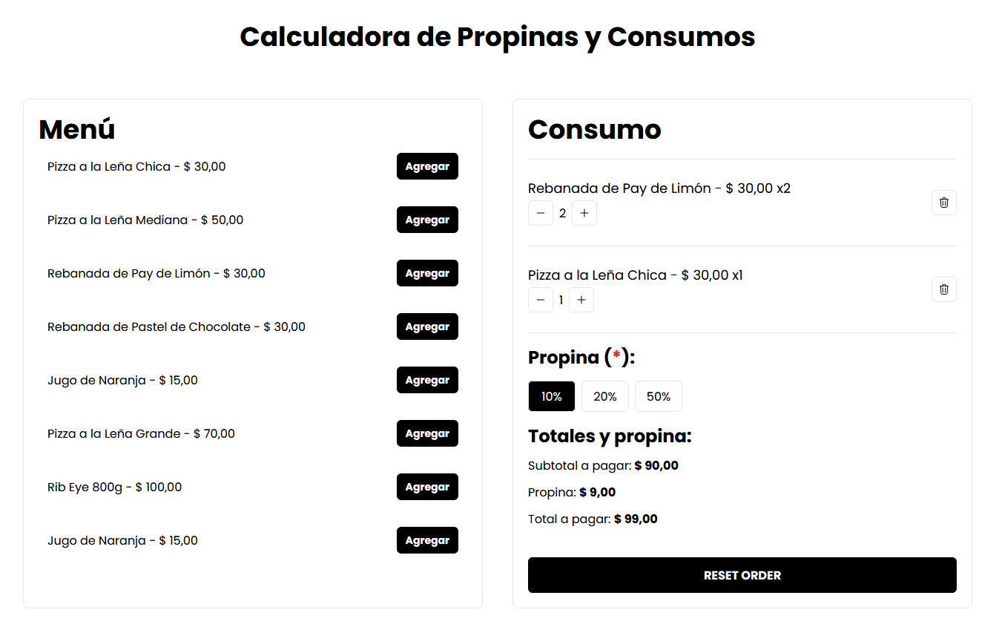

# Tip and Consumption Calculator

This is a tip calculator application developed in React + TypeScript that allows users to select products from a menu, calculate the subtotal, and apply a tip based on a selected percentage (10%, 20%, or 30%). The app displays a consumption cart where items can be removed, with the total dynamically updated in real-time.



## Features

- Interactive menu with products and prices.
- Shopping cart with options to add and remove items.
- Dynamic calculation of the subtotal and tip (10%, 20%, 50%).
- Real-time update of the total to pay when changing the tip percentage or items in the cart.

## Technologies Used

- **React** + **TypeScript**: For building the interactive interface and static typing.
- **Vite**: For fast and efficient bundling.
- **Tailwind CSS**: For custom styling and responsive design.
- **pnpm**: For efficient dependency management.

## Installation

1. Clone the repository:

   ```bash
   git clone https://github.com/your-username/your-repo.git
   ```

2. Navigate to the project directory:

   ```bash
   cd your-repo
   ```

3. Install dependencies:

   ```bash
   pnpm install
   ```

4. Start the development server:

   ```bash
   pnpm dev
   ```

5. Access the app at [http://localhost:5173](http://localhost:5173).

## Usage

1. Select products from the menu to add them to the cart.
2. Choose the desired tip percentage (10%, 20%, or 50%).
3. View the updated subtotal, tip, and total to pay, which adjust automatically.
4. You can remove items from the cart at any time to update the total.

## Contributions

If you'd like to contribute, please fork the repository, create a new branch with your changes, and submit a pull request.

## License

This project is licensed under the MIT License. For more details, please refer to the [LICENSE](LICENSE) file.

```

```
